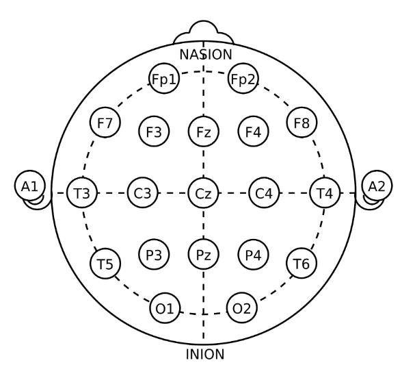

# EEG-Dataset-Visualization
## Dataset: ISRUC-SLEEP Dataset 
- Link to the dataset page: https://sleeptight.isr.uc.pt/ 
- Link to the paper with details of this dataset: https://www.sciencedirect.com/science/article/pii/S0169260715002734 
- General information about this dataset: 
  - 3 different subgroups, subgroup3 is collected from 10 healthy subjects.
  - Each dataset for one subject has 6 channels: F3-A2, C3-A2, O1-A2, F4-A1, C4-A1, O2-A1. 

  - In channel-extraction, for each subject, the last 30 epochs of data are not considered due to noise. The size of data in .mat file is 30 less than the size of data in excel.
  - Description of the columns and the abbreviations used on annotations of ISRUC-Sleep dataset: http://dataset.isr.uc.pt/ISRUC_Sleep/Content.pdf 
  - The classification of sleep stage can be found in corresponding Excel file. 30 seconds for each epoch, normally around 950 epochs (around 7.9 hours) 
  - Epochs and corresponding sleep stages are stored in an Excel file. 

## Dataset Segmentation 
The raw dataset of subject1 contains data from 6 channels, each channel is a matrix with size of 924x1000. Data in channel C3_A2 was used for developing visualization. For each epoch of 30 seconds, 6000 of data in microvoltages were collected and stored in the matrix. For subject1, there are 924 epochs in total for a whole night's sleep.  

With the following MATLAB script and pre-organized Excel file, the dataset was segmented into 4 different matrixes based on their sleep stages (REM, N1, N2, N3), making further visualization and analysis more convenient. A full cycle of sleep was also extracted from the dataset, from epochs #326 to #525. All these datasets were saved into different Mat files, which can be loaded later when needed.    
```Matlab
clc; clear;

N1 = readvars('1_1.xlsx','Sheet','Sheet1','Range','P1:P925');
N1 = rmmissing(N1);
N2 = readvars('1_1.xlsx','Sheet','Sheet1','Range','Q1:Q925');
N2 = rmmissing(N2);
N3 = readvars('1_1.xlsx','Sheet','Sheet1','Range','R1:R925');
N3 = rmmissing(N3);
REM = readvars('1_1.xlsx','Sheet','Sheet1','Range','S1:S925');
REM = rmmissing(REM);
% N1:  114 epochs
% N2:  369 epochs
% N3:  178 epochs
% REM: 101 epochs

% extract a full cycle from original dataset: 326-525 in 1_1
dataset = matfile('subject1.mat');
dataset_1cycle = [];
for i = 326:525
    dataset_1cycle = [dataset_1cycle, dataset.C3_A2(i, :)];
end

```

## Data Visualization 
- EEG signal waveform and spectrogram of different sleep stages:  
  - With the help of the Chronux toolbox, using mtsecgramc() function with the proper setup of sampling rate, frequency range, tapers, and moving windows, the spectrograms of EEG signal waveforms can be plotted out.  

  - Sampling rate is based on the dataset. Here the sampling rate of the dataset we use is 6000/30s = 200. 
  - Frequency range limits the range of Y-axis for plotting. Since the frequency of the EEG signal during sleep is around 0 to 30Hz, the range of [0 20-50] should work.  
  - The tapers and movingWin are more to do with the resolution of the spectrogram. Larger sample for X-axis, larger values for tapers and movingWin.  
      ```Matlab
      params.Fs     = 200;     % sampling rate 
      params.fpass  = [0 20];  % limit the frequency range for display 
      params.tapers = [3 4];   
      movingWin = [0.6 0.1];   
      params.trialave = 0;
      params.err = 1;

      subplot(8,1,1)
      plot(epoch_N1)
      title("N1");
      subplot(8,1,2)
      [Sc,t,f]=mtspecgramc(epoch_N1,movingWin,params);
      imagesc(t,f,Sc');
      set(gca,'YDir','normal') % used to inverse the Y-axis of the plot
      colormap("turbo");       % change color of the spectrogram 
      ```
- Hypnogram and spectrogram of a sleep cycle:
  - To better visualize and compare the sleep stages during a complete cycle, a hypnogram and a spectrogram were plotted out.  
    ```Matlab
    params.Fs     = 200;     % sampling rate 
    params.fpass  = [0 20];  % limit the frequency range for display 
    params.tapers = [25 49];
    movingWin = [30 15];
    params.trialave = 0;
    params.err = 1;

    subplot(3,1,1)
    plot(dataset_1cycle)
    title("1 Cycle");

    subplot(3,1,2)
    y_values = [1 2 3 4 5];
    y_labels = {'N1', 'N2', 'N3', 'REM', "Wake"};
    plot(stages_1cycle);
    set(gca, 'Ytick', y_values, 'YTickLabel', y_labels);
    grid on 

    subplot(3,1,3)
    [Sc,t,f]=mtspecgramc(dataset_1cycle,movingWin,params);
    imagesc(t,f,Sc');
    set(gca,'YDir','normal') % flip the graph
    colormap("turbo");
    ```
    
    - Plotting the spectrogram of a cycle was done by appending 200 epochs (1x6000) of a cycle one after one into a 1x1200000 matrix.  
    - Plotting the hypnogram of a cycle was done by plotting a 1x200 matrix (200 epochs in a cycle). Each contains different values representing different sleep stages.  
      | Sleep Stage  | Value |
      | ------------- | ------------- |
      | N1            | 1             |
      | N2            | 2             |
      | N3            | 3             |
      | REM  | 4  |
      | Wake  | 5  |
      


