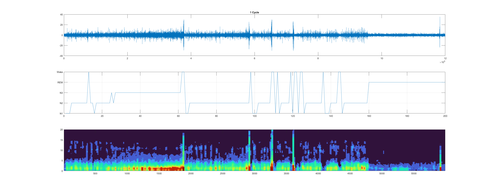

# EEG-Dataset-Visualization
## Dataset: ISRUC-SLEEP Dataset 
- Link to the dataset page: https://sleeptight.isr.uc.pt/ 
- Link to the paper with details of this dataset: https://www.sciencedirect.com/science/article/pii/S0169260715002734 
- General information about this dataset: 
  - 3 different subgroups, subgroup3 is collected from 10 healthy subjects.
  - Each dataset for one subject has 6 channels: F3-A2, C3-A2, O1-A2, F4-A1, C4-A1, O2-A1. 

